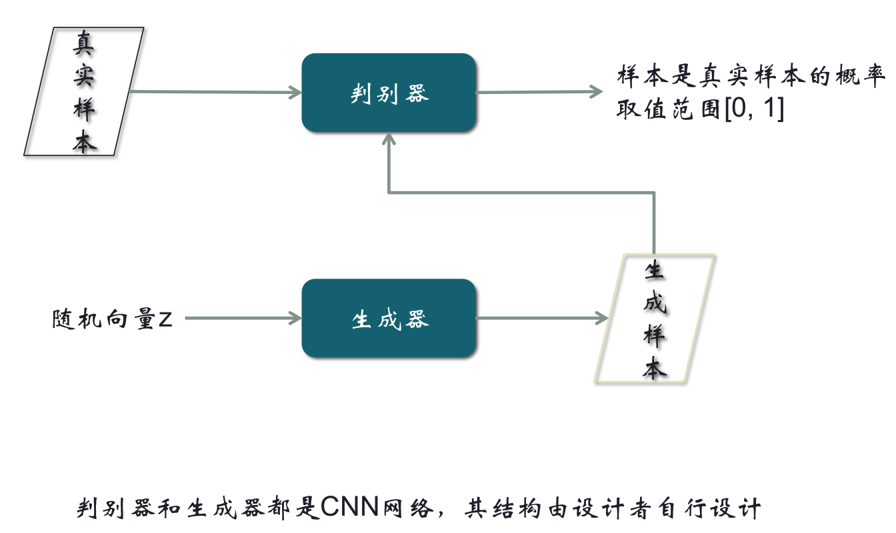

# pytorch-GAN-CGAN
### 模型介绍（GAN, CGAN）

#### GAN

 Generative Adversarial Nets是由lan Goodfellow[1]提出的一种训练生成式模型的新方法，包含了两个“对抗”的模型：生成器（G）用于学习训练集中的数据分布，判别器（D）用于判断一个样本来自真实数据而非生成样本的概率。为了学习在真实数据集x上的生成分布Pg，生成模型G构建一个从先验分布 $P_{data}$到数据空间的映射函数 $G(z; θ_g )$。 判别模型D的输入是真实图像和生成图像，D(x; θd )输出一个标量，表示输入样本来自训练样本（而非生成样本）的概率。 

判别器的训练目的是能够区分生成器的输出与来自训练集的真实图像，生成器的训练目的是欺骗判别器。**生成器从未直接见过训练集中的图像，它所知道的数据的信息都来自于判别器。**

判别器损失和生成器损失如下：

GAN的基本结构如下：

#### CGAN

条件生成式对抗网络（CGAN）是对原始GAN的一个扩展，生成器和判别器都增加额外信息y为条件，y可以使任意信息,例如类别信息,或者其他模态的数据。如Figure 1所示，通过将额外信息y输送给判别模型和生成模型,作为输入层的一部分,从而实现条件GAN。在生成模型中，先验输入噪声p(z)和条件信息y联合组成了联合隐层表征。对抗训练框架在隐层表征的组成方式方面相当地灵活。类似地，条件GAN的目标函数是带有条件概率的二人极小极大值博弈（two-player minimax game ）：

![\min _ { G } \max _ { D } V ( D , G ) = \mathbb { E } _ { \boldsymbol { x } \sim p _ { \text { data } } ( \boldsymbol { x } ) } [ \log D ( \boldsymbol { x } | \boldsymbol { y } ) ] + \mathbb { E } _ { \boldsymbol { z } \sim p _ { \boldsymbol { z } } ( \boldsymbol { z } ) } [ \log ( 1 - D ( G ( \boldsymbol { z } | \boldsymbol { y } ) ) ) ]](http://latex.codecogs.com/gif.latex?%5Cmin%20_%20%7B%20G%20%7D%20%5Cmax%20_%20%7B%20D%20%7D%20V%20%28%20D%20%2C%20G%20%29%20%3D%20%5Cmathbb%20%7B%20E%20%7D%20_%20%7B%20%5Cboldsymbol%20%7B%20x%20%7D%20%5Csim%20p%20_%20%7B%20%5Ctext%20%7B%20data%20%7D%20%7D%20%28%20%5Cboldsymbol%20%7B%20x%20%7D%20%29%20%7D%20%5B%20%5Clog%20D%20%28%20%5Cboldsymbol%20%7B%20x%20%7D%20%7C%20%5Cboldsymbol%20%7B%20y%20%7D%20%29%20%5D%20+%20%5Cmathbb%20%7B%20E%20%7D%20_%20%7B%20%5Cboldsymbol%20%7B%20z%20%7D%20%5Csim%20p%20_%20%7B%20%5Cboldsymbol%20%7B%20z%20%7D%20%7D%20%28%20%5Cboldsymbol%20%7B%20z%20%7D%20%29%20%7D%20%5B%20%5Clog%20%28%201%20-%20D%20%28%20G%20%28%20%5Cboldsymbol%20%7B%20z%20%7D%20%7C%20%5Cboldsymbol%20%7B%20y%20%7D%20%29%20%29%20%29%20%5D)

CGAN的结构如下：

#### DCGAN

DCGAN的原理和GAN是一样的。它只是把G和D换成了两个卷积神经网络（CNN）。但不是直接换就可以了，DCGAN对卷积神经网络的结构做了一些改变，以提高样本的质量和收敛的速度，这些改变有：

**a.** 取消所有pooling层。G网络中使用转置卷积（transposed convolutional layer）进行上采样，D网络中用加入stride的卷积代替pooling。

**b.** 在D和G中均使用batch normalization

**c.** 去掉FC层，使网络变为全卷积网络

**d.** G网络中使用ReLU作为激活函数，最后一层使用tanh

**e.** D网络中使用LeakyReLU作为激活函数

DCGAN的生成器结构如下：

### 实验结果

在mnist数据集上训练CGAN，条件y为数字标签对于的one-hot向量。输入是100维服从均匀分布的噪声向量z，将条件y和z进行连接，作为生成器的输入。生成器输出784维向量，重置输出向量的形状为20x28，即得到28*28的单通道图像。 
判别模型的输入是784维的图像数据和条件变量y（类别标签的one hot编码），输出是该样本来自真实数据样本的概率。 

本实验中GAN的结构如下：

- GAN 结果

本实验中DCGAN的结构如图：

- 
  DCGAN 结果

本实验对CGAN 有两种不同实现方式：

1. 左边是将标签y直接连接到输入样本。（在生成器输入层连接）
2. 右边是将标签y映射到高维隐层，在隐层进行连接。

可以看出方法1生成的图像噪音点更少，但是比方法2的图像模糊。

     
